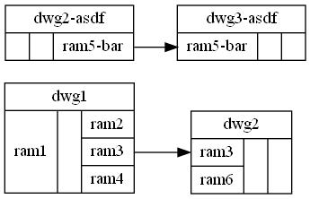
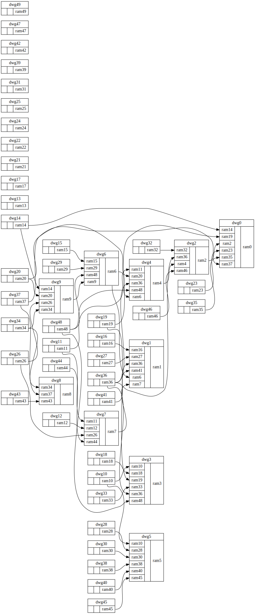

# gwd
dwg

## input
rams_output.csv
```
dwg1,ram1,ext
dwg1,ram2,pub
dwg1,ram3,pub
dwg1,ram4,pub
dwg2,ram3,ext
dwg2,ram6,ext
dwg2-asdf,ram5-bar,pub
dwg3-asdf,ram5-bar,ext

```

## output



## Samples



